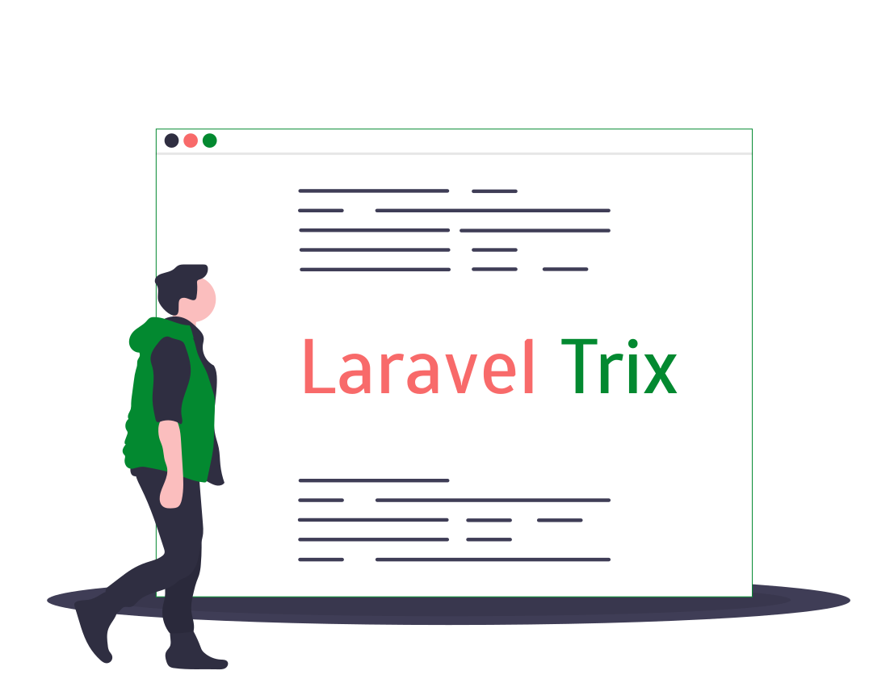

<p align="center"></p>

<p align="center">
<a href="https://github.com/Te7a-Houdini/laravel-trix/releases"></a>
<a href="https://travis-ci.org/Te7a-Houdini/laravel-trix"></a>
<a href="https://github.styleci.io/repos/217703400"></a>
<a href="https://scrutinizer-ci.com/g/Te7a-Houdini/laravel-trix/?branch=master"></a>
<a href="https://github.com/Te7a-Houdini/laravel-trix/blob/master/LICENSE.md"></a>
<a href="https://packagist.org/packages/te7a-houdini/laravel-trix"></a>

</p>

## Configurable [Basecamp Trix Editor](https://trix-editor.org/) delivered to your laravel application

inspired by [Rails Action Text](https://edgeguides.rubyonrails.org/action_text_overview.html)


* [Installation](#installation)
* [Usage](#usage)
  * [Using @trix($model, $field, $config = [])](#using-@trix($model,-$field,-$config-=-[]))
  * [Storing Rich Text Fields](#storing-rich-text-fields)
  * [Render Trix For Existing Model](#render-trix-for-existing-model)
  * [Storing Attachment](#storing-attachment)
  * [Changing Storage Disk](#changing-storage-disk)
  * [Configuration Table](#configuration-table)
* [Testing](#testing)

## Installation

You can install the package via composer:

```bash
composer require te7a-houdini/laravel-trix
```

Then publish the configurations and migrations:

```bash
php artisan vendor:publish --provider="Te7aHoudini\LaravelTrix\LaravelTrixServiceProvider"
```

After the migration has been published then run the migrations to create required tables:

```bash
php artisan migrate
```

then add `@trixassets` directive at the head tag of your html
```html
<html>
    <head>
        @trixassets
    </head>
</html>
```


## Usage

let's assume we have `Post model` & want to add trix editor.

### Using @trix($model, $field, $config = [])
you can use @trix directive inside any view to render trix editor.

```html
<html>
    <head>
        @trixassets
    </head>

    <body>
        <!-- notice that content field isn't presented in Post model -->
        @trix(\App\Post::class, 'content')
    </body>
</html>

```

### Storing Rich Text Fields
now lets try to store `content` rich text field when hitting submit button.

```html
<html>
    <head>
        @trixassets
    </head>

    <body>
        <form method="POST" action="{{ route('posts.store') }}">
            @csrf
            @trix(\App\Post::class, 'content')
            <input type="submit">
        </form>
    </body>
</html>

```
first add `HasTrixRichText` trait to your model

``` php
namespace App;

use Illuminate\Database\Eloquent\Model;
use Te7aHoudini\LaravelTrix\Traits\HasTrixRichText;

class Post extends Model
{
    use HasTrixRichText;

    protected $guarded = [];
}
```
then you can easily store any rich text fields by multiple ways:

```php
Post::create(request()->all());

//storing must follow this convention (model lowered class name)-trixFields
Post::create([
    'post-trixFields' => request('post-trixFields'),
]);

```


### Render Trix For Existing Model

there's multiple ways to render trix for already existing model

```php
<!-- inside view blade file -->

@trix($post, 'content')

{!! $post->trix('content') !!} //must use HasTrixRichText trait in order for $model->trix() method work

{!! app('laravel-trix')->make($post, 'content') !!}
```


### Storing Attachment

when uploading a file to trix editor. an ajax request is sent to `store_attachment_action` in `laravel-trix` config file. which uses [Laravel Storage](https://laravel.com/docs/master/filesystem#introduction) and then this action returns `url` if upload is success according to [Basecamp Trix api](https://github.com/basecamp/trix#storing-attached-files) .

the uploaded file will be stored in `trix_attachments` table as `pending` attachment.

once model is saved . all `pending` attachments will have `is_pending` column = `0`

so in order to make storing attachment very easy make sure to use `HasTrixRichText` trait in your model.

```php
Post::create(request()->all());

//storing must follow this convention (model lowered class name)-trixFields
//and for attachment must follow attachment-(model lowered class name)-trixFields
Post::create([
    'post-trixFields' => request('post-trixFields'),
    'attachment-post-trixFields' => request('attachment-post-trixFields')
]);

```

### Changing Storage Disk

you can change attachment storage disk from `laravel-trix` config file .

```php
return [
    'storage_disk' => env('LARAVEL_TRIX_STORAGE_DISK', 'public'),

    'store_attachment_action' => Te7aHoudini\LaravelTrix\Http\Controllers\TrixAttachmentController::class . '@store',

    'destroy_attachment_action' => Te7aHoudini\LaravelTrix\Http\Controllers\TrixAttachmentController::class . '@destroy',
];
```

or if you want to change the storage disk for specific rich text field you can do that

```php
@trix($post, 'content', ['disk' => 'local'])
```

### Deleting Rich Text Field and Attachments

you can remove related rich text fields and attachments on a model deleting:

```php
class Post extends Model
{
    use HasTrixRichText;

    protected $guarded = [];

    protected static function boot()
    {
        parent::boot();

        static::deleted(function ($post) {
            $post->trixRichText->each->delete();
            $post->trixAttachments->each->purge();
        });
    }
}
```

### Configuration Table

if you want to hide buttons or toolbar you can do this. for more configuration refer to the table below.

```php
@trix($post, 'content', [ 'hideButtonIcons' => ['attach', 'bold'] ])

@trix($post, 'content', [ 'hideTools' => ['text-tools'] ])

```
| configuration   | type    | values | description
|-----------------|---------|-----------------------------------------------------------------------------------------------------------------------------------------------------------------------|------------------------
| hideToolbar | Boolean | True or False | hides the the toolbar
| hideTools   | Array   | ['text-tools', 'block-tools', 'file-tools', 'history-tools'] | hides group of buttons
| hideButtonIcons   | Array   | ['attach', 'bold', 'italic', 'strike', 'link', 'heading-1', 'quote', 'code', 'bullet-list', 'number-list',  'decrease-nesting-level', 'increase-nesting-level'] | hides a single button
| disk   | String   | 'local' or 's3' or 'any-disk' | sets the attachment storage per field
| id     | String  | 'any-value-you-want' | the id of input which renders [trix. check this link](https://github.com/basecamp/trix#integrating-with-forms) . current id follows this convention `(model lowered class name)-field-modelId` like `post-content-1` or `post-content-new-model`
| containerElement | String | valid html tag like `span` or `div` | default container tag is set to `span` you can change it as you want


### Testing

``` bash
composer test
```

### Changelog

Please see [CHANGELOG](CHANGELOG.md) for more information what has changed recently.

### Security

If you discover any security related issues, please email ahmedabdelftah95165@gmail.com instead of using the issue tracker.

## Credits

- [Ahmed Abd El Ftah](https://github.com/Te7a-Houdini)
- [All Contributors](../../contributors)

## License

The MIT License (MIT). Please see [License File](LICENSE.md) for more information.
